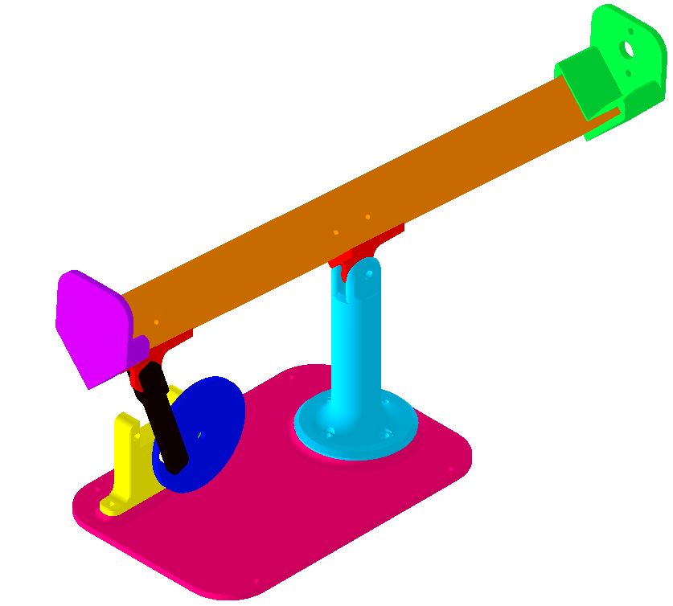
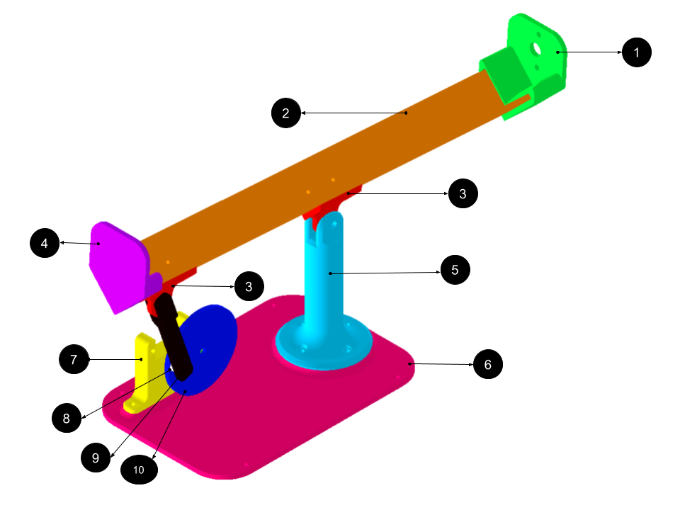
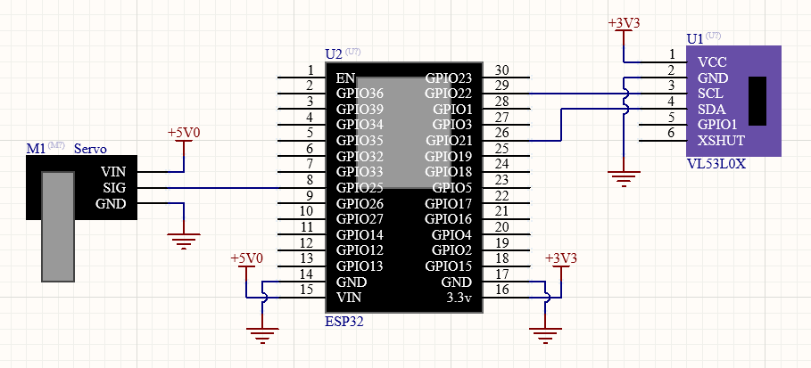
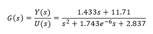

<h1 align="center">
Maqueta Barra y bola
</h1>

---
## Descripción
Maqueta **Barra y Bola** Para aplicar métodos de control automático. Para esta maqueta se han
dispobilizado todas las partes y piezas en formato .ipt (Autodesk Inverntor) y .stl para impresoras
3D.

El firmware implementado considera la utilización de un controlador PID discreto, con filtro N para
la parte derivativa. 

## Tabla de contenido <!-- omit in toc -->
- [Descripción](#descripción)
- [Partes y piezas](#partes-y-piezas)
- [Electrónica](#electrónica)
- [Modelo del sistema](#modelo-del-sistema)
---

## Partes y piezas

Las partes y piezas a imprimir son:

1. tapa_sensor
2. barra
3. 2x sujetadores
4. tapa_sin_sensor
5. soporte_barra
6. base
7. soporte_servomotor
8. separador
9. brazo_servomotor
10. rueda

Para unir todas estas piezas se requiere:

- 8 pernos M2 de 6mm de largo
- 8 Insertos M2 para plástico
- 10 pernos M3 de 10mm de largo
- 10 tuercas M3
- 2 pernos M4 de 20mm de largo
- 1 perno M4 de 25mm de largo 
- 3 tuercas a presión M4

La fabricación de todas las partes y piezas fue con la impresora 3D CR-10s PRO V2.
## Electrónica
Los materiales electrónicos son:
- 1 ESP32 DEV KIT V1
- 1 Servomotor SG90
- 1 Sensor de distancia láser VL53L0X

El diagrama de conexiones es el siguiente:

## Modelo del sistema

El modelo del sistema fue obtenido mediante Matlab con la herramienta **SystemIdentification**,
entregando la función de transferencia:

La prueba consistió en posicionar la bola a 5cm del sensor. Pasado 1 segundo, se dió un escalón de
20° para medir cada 0.1s el comportamiento de la bola, hasta llegar a la tapa.