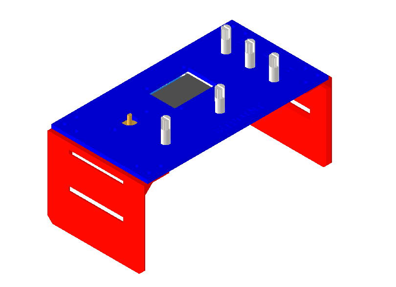
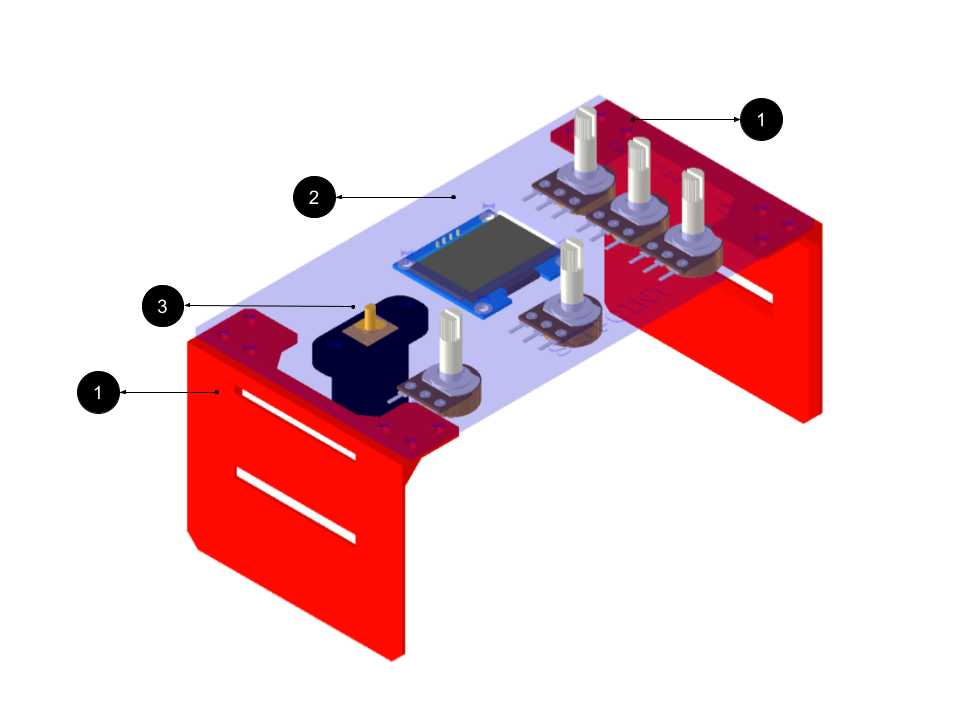
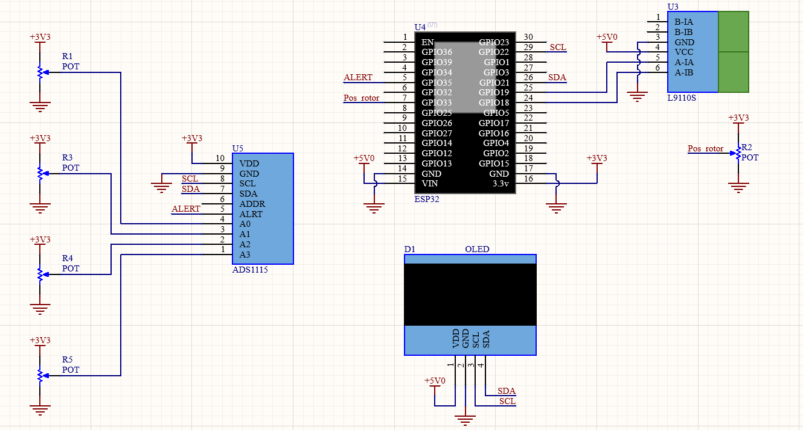
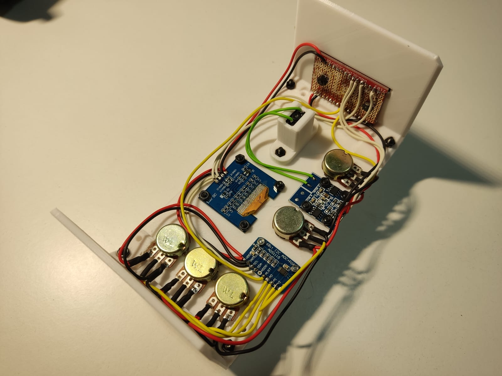

<h1 align="center">
Maqueta demostración de funcionamiento servo motor
</h1>

---
## Descripción

## Tabla de contenido <!-- omit in toc -->
- [Descripción](#descripción)
- [Partes y piezas](#partes-y-piezas)
- [Electrónica](#electrónica)
- [Modelo del sistema](#modelo-del-sistema)
---

## Partes y piezas

1. 2x patas
2. base
3. soporte motor

Para unir todas las partes y electrónica se requiere:

- 6 pernos M3 de 12mm de largo
- 8 pernos M3 de 6mm de largo
- 14 tuercas M3
- 2 pernos M2 de 6mm de largo
- 2 tuercas M2 de 6mm de largo

## Electrónica

Los materiales electrónicos son:

- 1 ESP32 DEVKIT V1
- 4 Potenciómetro de panel de 100k
- 1 Módulo ADC ADS1115
- 1 Motor DC N20
- 1 Módulo puente H L9110s
- 1 Display I2C OLED 128x64 pixeles 1.3"

El circuito electrónico implementado es el siguiente:

Una muestra de las posiciones y conexiones de los módulos:

## Modelo del sistema
Para este modelo no se obtuvo la función de transferencia ya que la maqueta está pensada para
ajustar los valores mediante los potenciómetros por lo que se espera que el control se realice
mediante prueba y error.